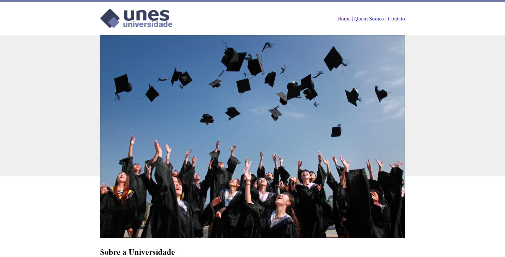
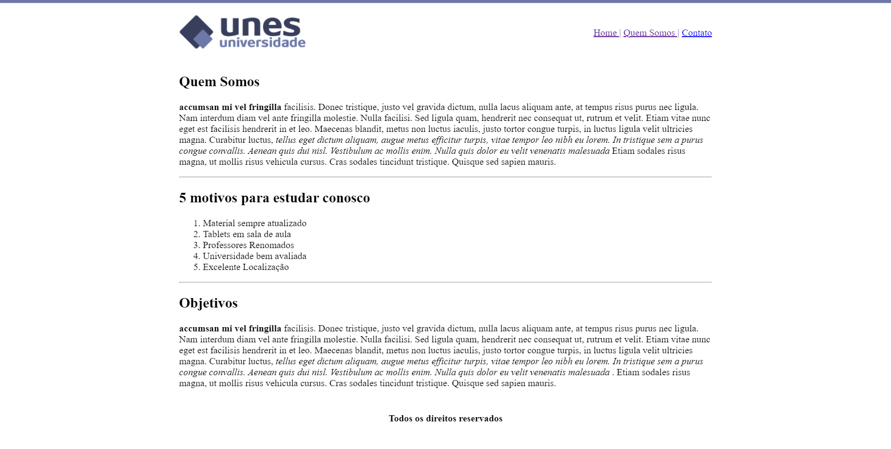

# PROJETO UNIVERSIDADE UNES

Projeto baseado no exercicio proposto no curso Desenvolvimento Web completo 2022,UDEMY
Composto de 3 páginas com as estruturas básicas do HTML :  listas, formulário, inserção de imagens, tabelas ,links.
A organização da página foi feita em tabelas, mas é sempre bom lembrar que não é recomendado. Foram usadas uniamente para se ater 
apenas aos recursos aprendidos até o momento do curso.
Index - home
Sobre - Quem Somos
Contato
imagem de capa by Pexels 
Logos fornecidos no material do curso

Segue imagens das páginas:

